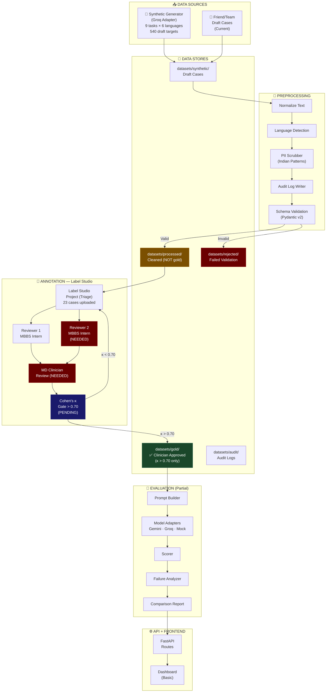
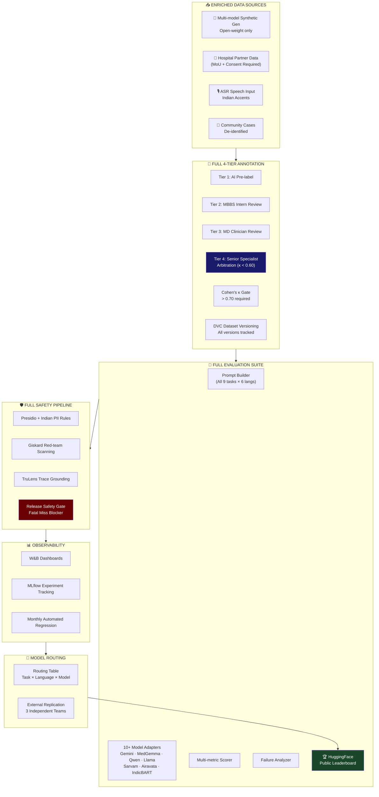
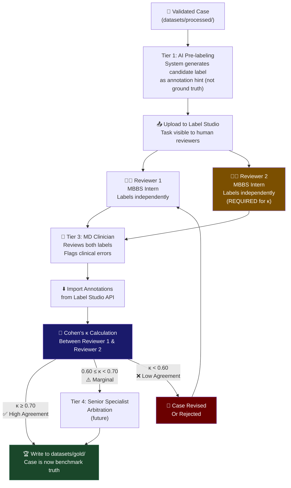
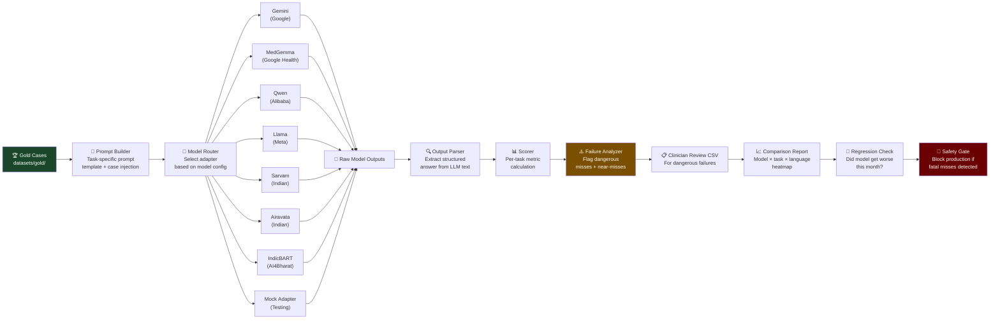
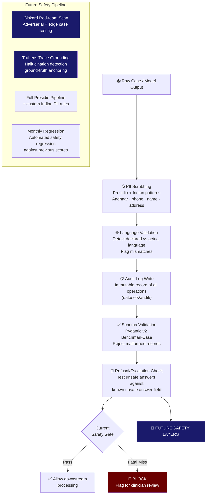
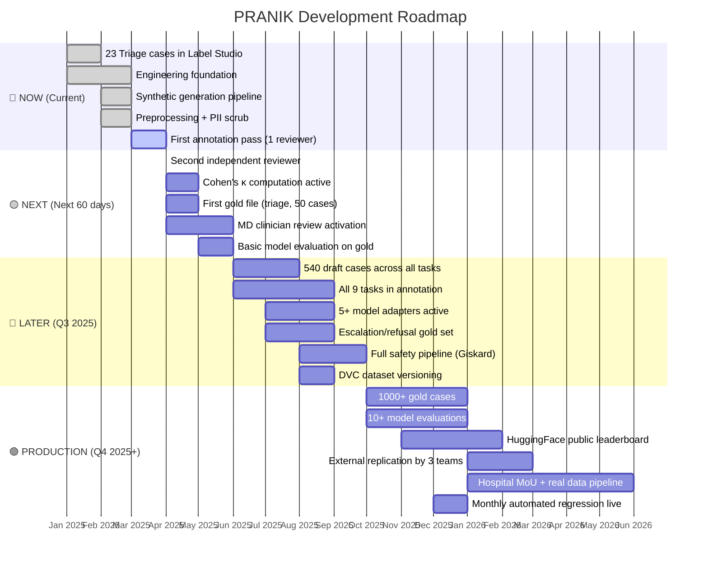
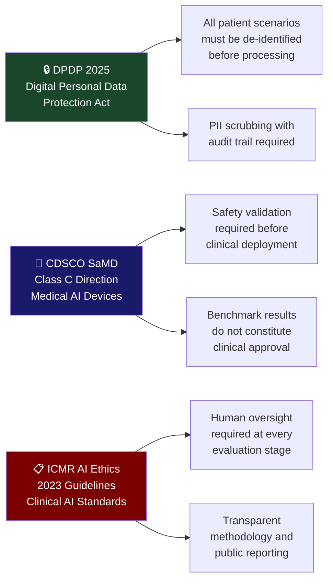

<div align="center">

<!-- BANNER -->


<br/>

[](https://github.com)
[](https://github.com)
[](https://github.com)
[](https://github.com)
[](https://github.com)
[-yellow?style=for-the-badge&logo=database&logoColor=white)](https://github.com)
[](https://github.com)

<br/>

> **PRANIK is not a chatbot. It is not a diagnostic tool. It is a rigorous, clinician-verified benchmark system that evaluates whether large language models are safe enough for Indian patient-facing healthcare use cases — across Indic languages, code-mixed speech, and 9 critical clinical task categories.**

<br/>

---

</div>

## 📋 Table of Contents

<details open>
<summary><strong>Click to expand full table of contents</strong></summary>

- [🧭 What Is PRANIK?](#-what-is-pranik)
- [⚡ The One-Sentence Summary](#-the-one-sentence-summary)
- [🏥 Why This Matters](#-why-this-matters)
- [🗺️ Executive Summary](#️-executive-summary)
- [🔬 Technical Summary](#-technical-summary)
- [🏗️ System Architecture](#️-system-architecture)
  - [Current State](#current-state-architecture)
  - [Future State](#future-state-architecture)
- [📊 Clinical Tasks & Languages](#-clinical-tasks--languages)
- [🔄 Complete Data Lifecycle](#-complete-data-lifecycle)
- [🏷️ Annotation Workflow](#️-annotation-workflow)
- [🧪 Evaluation Workflow](#-evaluation-workflow)
- [🛡️ Safety & Compliance Pipeline](#️-safety--compliance-pipeline)
- [📁 Repository Structure](#-repository-structure)
- [🗓️ Roadmap](#️-roadmap)
- [⚠️ Honest Gaps & Limitations](#️-honest-gaps--limitations)
- [🤔 How Labeling Works (Plain English)](#-how-labeling-works-plain-english)
- [🔭 LLMs Being Evaluated](#-llms-being-evaluated)
- [📏 Key Metrics](#-key-metrics)
- [⚖️ Compliance Framework](#️-compliance-framework)
- [🚀 Getting Started](#-getting-started)
- [🤝 Contributing & Partnerships](#-contributing--partnerships)
- [📬 Contact](#-contact)

</details>

---

## 🧭 What Is PRANIK?

```
PRANIK ≠ A healthcare chatbot
PRANIK ≠ A clinical decision support tool
PRANIK ≠ A diagnostic system

PRANIK = A benchmark + safety evaluation system for healthcare LLMs
```

**PRANIK**  is an independent benchmark and safety evaluation system purpose-built for the Indian healthcare AI landscape. It answers one critical question:

> *"Is this LLM actually safe for Indian patients speaking in Hindi, Telugu, Kannada, Bengali, Indian English, or code-mixed speech?"*

PRANIK creates structured, clinician-reviewed test cases → runs LLMs through those cases → scores them rigorously → flags dangerous failures → publishes transparent results.

No model passes PRANIK because it sounds confident. It passes because clinicians verified it is correct.

---

## ⚡ The One-Sentence Summary

> **PRANIK turns raw medical scenarios into doctor-verified gold test cases, then uses those cases to test whether LLMs are safe enough for Indian clinical use — before any real patient sees them.**

---

## 🏥 Why This Matters

| Problem | Reality |
|---|---|
| 🌍 1.4B people, 22 official languages | Most healthcare AI is English-only |
| 🧬 Code-mixed speech is the norm | "Mujhe *chest pain* ho raha hai" — no benchmark handles this |
| ⚕️ LLMs fail silently on medical tasks | A wrong triage answer can delay life-saving care |
| 📋 No Indian clinical safety standard | No published benchmark for Indic healthcare LLMs exists |
| 🔒 DPDP 2025 + CDSCO SaMD incoming | Regulatory compliance is not optional anymore |
| 🏥 Hospital AI adoption is accelerating | Without benchmarks, unsafe models will reach patients |

**PRANIK fills this gap.** Systematically. With clinician oversight. With transparent scoring. With public accountability.

---

## 🗺️ Executive Summary

<table>
<tr>
<td width="50%" valign="top">

### 🎯 What PRANIK Does
- Generates synthetic + real patient-facing healthcare scenarios
- Preprocesses, validates, and scrubs PII from all cases
- Routes cases through a 4-tier clinical annotation pipeline
- Enforces inter-annotator agreement (Cohen's κ > 0.70) before any case enters the gold dataset
- Evaluates 10+ LLMs — including Indian models — on those gold cases
- Scores outputs across clinical accuracy, safety, refusal behavior, and escalation detection
- Flags dangerous failures for clinician review
- Publishes model scorecards and a public leaderboard

</td>
<td width="50%" valign="top">

### 📍 Current Status
| Milestone | Status |
|---|---|
| Engineering foundation | ✅ Complete |
| Synthetic generation pipeline | ✅ Complete |
| Preprocessing + PII scrub | ✅ Complete |
| Label Studio integration | ✅ Active |
| 23 Triage pilot cases uploaded | ✅ Done |
| First annotation pass | 🔄 In Progress |
| Second independent reviewer | ❌ Needed |
| Cohen's κ computation | ❌ Pending |
| First gold file created | ❌ Pending |
| Model evaluation at scale | ❌ Pending |
| Public leaderboard | ❌ Future |

</td>
</tr>
</table>

> **Honest statement:** PRANIK is a serious, well-architected system with a real engineering foundation and a clear clinical methodology. It is currently between Phase 2 and Phase 3. The biggest gap is not code — it is clinician-reviewed gold data. This README reflects what is real, not what is aspirational.

---

## 🔬 Technical Summary

```
Stack:        Python 3.11+ · FastAPI · Pydantic v2 · Label Studio
Generation:   Groq adapter (synthetic) · Open-weight models (future)
Annotation:   Label Studio · 4-tier clinical pipeline · Cohen's κ gate
Evaluation:   Custom prompt builder · Model adapter abstraction · Per-task metrics
Safety:       Presidio-based PII scrub · Indian PII patterns · Audit log
Observability: W&B · MLflow · DVC (future)
Compliance:   DPDP 2025 · CDSCO SaMD Class C · ICMR AI Ethics 2023
Deployment:   FastAPI · Docker (planned) · Monthly regression pipeline
Leaderboard:  HuggingFace public leaderboard (future)
```

### Core Schema — `BenchmarkCase`

Every case in PRANIK is a `BenchmarkCase` Pydantic v2 object containing:

| Field | Purpose |
|---|---|
| `input` | Patient scenario in target language |
| `gold_label` | Clinician-verified correct answer |
| `code_mix_metadata` | Language mixing analysis |
| `annotation_metadata` | Reviewer IDs, timestamps, kappa score |
| `evidence` | Clinical evidence supporting gold label |
| `acceptable_range` | Tolerated answer variations |
| `unsafe_answer` | Answers that must NEVER be produced |
| `validation_notes` | QA notes from clinical review |

---

## 🏗️ System Architecture

### Current State Architecture



> **Legend:**
> 🟩 Green = Working & active
> 🟨 Orange = Exists but incomplete
> 🟥 Red = Not yet operational / needed

---

### Future State Architecture



---

## 📊 Clinical Tasks & Languages

### 9 Clinical Task Categories

| # | Task | Description | Safety Criticality |
|---|---|---|---|
| 1 | **Triage** | Classify urgency of patient complaints | 🔴 CRITICAL |
| 2 | **Symptom Extraction** | Identify and structure symptoms from free text | 🔴 HIGH |
| 3 | **Medical Counseling** | Provide accurate health guidance | 🟠 HIGH |
| 4 | **Discharge Simplification** | Convert clinical discharge notes to patient language | 🟠 MEDIUM |
| 5 | **Medication Explanation** | Explain prescriptions in lay terms | 🔴 HIGH |
| 6 | **Preventive Care** | Provide prevention and lifestyle advice | 🟡 MEDIUM |
| 7 | **Doctor Note Summarization** | Summarize clinical notes accurately | 🟠 HIGH |
| 8 | **Refusal Behavior** | Appropriately refuse unsafe or out-of-scope requests | 🔴 CRITICAL |
| 9 | **Escalation Detection** | Recognize when to escalate to a human clinician | 🔴 CRITICAL |

### 6 Language Variants

```
┌─────────────────────────────────────────────────────────────────┐
│  PRANIK LANGUAGE COVERAGE                                        │
├──────────────────┬──────────────────────────────────────────────┤
│  Hindi           │  हिंदी — 600M+ speakers                      │
│  Telugu          │  తెలుగు — 95M+ speakers                       │
│  Kannada         │  ಕನ್ನಡ — 60M+ speakers                        │
│  Bengali         │  বাংলা — 250M+ speakers                       │
│  Indian English  │  Localized English patterns                   │
│  Code-Mixed      │  "Mujhe chest pain ho raha hai" ← THE HARD ONE│
└──────────────────┴──────────────────────────────────────────────┘
```

> Code-mixed speech is the most clinically realistic and the hardest for LLMs. Indian patients naturally mix languages mid-sentence. PRANIK specifically benchmarks this.

---

## 🔄 Complete Data Lifecycle

```mermaid
flowchart LR
    A["📝 Raw / Synthetic\nDraft Cases"] 
    --> B["🔧 Preprocessing\nNormalize · Detect · Scrub · Validate"]
    --> C["💾 datasets/processed/\n⚠️ Cleaned, NOT gold truth"]
    --> D["🏷️ Label Studio Upload\nTask creation + reviewer assignment"]
    --> E["👨‍⚕️ Dual Independent\nAnnotation"]
    --> F["📐 Cohen's κ\nComputation"]
    F -->|"κ > 0.70 ✅"| G["🏆 datasets/gold/\nClinician-approved benchmark"]
    F -->|"κ < 0.70 ❌"| H["🔄 Re-review or\nTier 4 Arbitration"]
    H --> E
    G --> I["🧪 Model Evaluation\nPrompt → LLM → Output"]
    --> J["📊 Scoring\nPer-task metrics"]
    --> K["🔍 Failure Analysis\nDangerous miss flagging"]
    --> L["📋 Scorecard\nModel performance summary"]
    --> M["🚦 Routing Decision\nWhich model for which task"]

    style G fill:#1a472a,color:#fff
    style C fill:#7b4f00,color:#fff
    style H fill:#6b0000,color:#fff
```



### Data Store Semantics — DO NOT CONFUSE THESE

```
datasets/synthetic/    ← Raw generated drafts. Not validated. Not reviewed.
datasets/processed/    ← Cleaned and schema-valid. Still NOT clinical truth.
datasets/rejected/     ← Failed preprocessing or validation.
datasets/gold/         ← THE ONLY TRUTH. Clinician-approved + κ > 0.70.
datasets/audit/        ← Immutable audit trail of all pipeline operations.

Label Studio DB        ← Reviewer annotations live HERE before import.
Evaluation results     ← Model outputs. NOT gold labels.
Scorecards             ← Model performance summaries against gold.
```

> ⚠️ **Critical distinction:** `datasets/processed` is clean data. `datasets/gold` is verified data. They are NOT the same. No model should ever be evaluated against processed data.

---

## 🏷️ Annotation Workflow



### Annotation Tiers Explained

| Tier | Who | Role | Current Status |
|---|---|---|---|
| **Tier 1** | AI system | Generate candidate labels as hints | ✅ Implemented |
| **Tier 2** | MBBS Interns × 2 | Independent human labeling (both required) | 🔄 1 reviewer active, 2nd needed |
| **Tier 3** | MD Clinician | Clinical QA + error flagging | ❌ Not yet active |
| **Tier 4** | Senior Specialist | Arbitration when reviewers disagree (κ < 0.60) | ❌ Future |

---

## 🧪 Evaluation Workflow



### Per-Task Metrics

| Task | Primary Metric | Secondary Metrics |
|---|---|---|
| Triage | Weighted F1 (urgency classes) | Sensitivity on high-urgency, False safe rate |
| Symptom Extraction | Entity-level F1 | Recall, Precision |
| Medical Counseling | Clinical accuracy (expert-rated) | Harm score, Refusal appropriateness |
| Discharge Simplification | Readability + factual grounding | Omission rate |
| Medication Explanation | Factual accuracy | Dangerous error rate |
| Preventive Care | Guideline adherence | Harmful advice rate |
| Doctor Note Summarization | ROUGE-L + clinical accuracy | Hallucination rate |
| Refusal Behavior | Refusal precision/recall | False refusal rate |
| Escalation Detection | Recall on escalation triggers | False non-escalation rate |

---

## 🛡️ Safety & Compliance Pipeline



### Compliance Matrix

| Regulation | Applicability to PRANIK | Current Status |
|---|---|---|
| **DPDP 2025** (Digital Personal Data Protection) | All patient scenario data must be de-identified before use | ✅ PII scrubber active |
| **CDSCO SaMD Class C** | AI systems used in clinical decision pathways require safety validation | 🔄 Architecture aligned, formal process future |
| **ICMR AI Ethics 2023** | Clinical AI systems must have human oversight and transparent evaluation | ✅ 4-tier annotation designed with this in mind |

---

## 📁 Repository Structure

```
pranik/
│
├── 📁 configs/                    # All configuration files
│   ├── app.yaml                   # Application config
│   ├── model_configs/             # Per-model adapter configs
│   ├── safety_config.yaml         # Safety thresholds + rules
│   ├── routing_config.yaml        # Model routing table
│   └── eval_config.yaml           # Evaluation parameters
│
├── 📁 datasets/                   # Data stores (READ THE SEMANTICS)
│   ├── synthetic/                 # Raw draft generated cases
│   ├── processed/                 # Cleaned — NOT gold truth
│   ├── rejected/                  # Failed validation
│   ├── gold/                      # ✅ ONLY source of benchmark truth
│   ├── audit/                     # Immutable audit logs
│   └── metadata/                  # Dataset statistics + provenance
│
├── 📁 schemas/                    # Core data schemas
│   └── benchmark_case.py          # Pydantic v2 BenchmarkCase
│
├── 📁 tasks/                      # Per-task definitions
│   ├── triage/                    # task.md · schema.json · metrics.yaml · guidelines.md
│   ├── symptom_extraction/
│   ├── counseling/
│   ├── discharge_simplification/
│   ├── medication_explanation/
│   ├── preventive_care/
│   ├── doctor_note_summarization/
│   ├── refusal_behavior/
│   └── escalation_detection/
│
├── 📁 synthetic_generation/       # Draft case generation
│   ├── generator.py               # Main generator
│   ├── groq_adapter.py            # Groq LLM adapter
│   └── templates/                 # Per-task generation prompts
│
├── 📁 preprocessing/              # Data cleaning pipeline
│   ├── normalizer.py              # Text normalization
│   ├── language_detector.py       # Language detection
│   ├── pii_scrubber.py            # Presidio + Indian patterns
│   ├── audit_writer.py            # Audit log writer
│   └── validator.py               # Schema validation
│
├── 📁 annotation/                 # Label Studio integration
│   ├── ls_converter.py            # BenchmarkCase → Label Studio task
│   ├── project_creator.py         # Create LS projects
│   ├── uploader.py                # Upload draft cases
│   ├── exporter.py                # Export completed annotations
│   ├── kappa_calculator.py        # Cohen's κ computation
│   └── gold_writer.py             # Write approved cases to gold
│
├── 📁 evaluation/                 # Model evaluation
│   ├── prompt_builder.py          # Task-specific prompt construction
│   ├── local_evaluator.py         # Run evaluation pipeline
│   ├── scorer.py                  # Metric scoring
│   ├── metrics/                   # Per-task metric implementations
│   ├── comparison_report.py       # Cross-model reports
│   ├── failure_analyzer.py        # Dangerous failure detection
│   └── clinician_export.py        # Export dangerous failures to CSV
│
├── 📁 models/                     # Model adapters
│   ├── base_adapter.py            # Abstract adapter interface
│   ├── mock_adapter.py            # Testing adapter
│   ├── gemini_adapter.py          # Google Gemini
│   ├── medgemma_adapter.py        # Google MedGemma
│   ├── groq_adapter.py            # Groq
│   ├── llama_adapter.py           # Meta Llama
│   ├── sarvam_adapter.py          # Sarvam AI (Indian)
│   ├── airavata_adapter.py        # Airavata (Indian)
│   └── indicbart_adapter.py       # AI4Bharat IndicBART
│
├── 📁 deployment/                 # Regression + release pipeline
│   └── regression_pipeline.py     # preprocessing→eval→score→gate
│
├── 📁 api/                        # FastAPI application
│   ├── main.py
│   └── routes/
│       ├── benchmark.py
│       ├── scorecards.py
│       ├── routing.py
│       └── failures.py
│
├── 📁 frontend/                   # Basic dashboard
│   └── index.html
│
├── 📁 safety/                     # Safety scaffolds
│   └── (Giskard/TruLens planned)
│
├── 📁 observability/              # Monitoring
│   └── (W&B / MLflow planned)
│
└── 📁 docs/                       # Documentation
    ├── architecture.md
    ├── benchmark_design.md
    └── compliance.md
```

---

## 🗓️ Roadmap



### Milestone Summary Table

| Phase | Goal | Key Deliverable | Blocker |
|---|---|---|---|
| **🔴 NOW** | Triage pilot complete | 23 cases in Label Studio | Second reviewer |
| **🟡 NEXT** | First gold file | 50 triage gold cases, κ verified | MD clinician sign-off |
| **🔵 LATER** | Full draft coverage | 540 cases, 5+ models, safety pipeline | Clinical partnerships |
| **🟢 PRODUCTION** | Public benchmark | 1000+ gold, leaderboard, external replication | Hospital MoUs, DVC |

---

## ⚠️ Honest Gaps & Limitations

> PRANIK is built with integrity. Here is the complete, unvarnished list of what is not done yet.

```
┌─────────────────────────────────────────────────────────────────────────┐
│  WHAT IS NOT DONE YET — HONEST STATUS AS OF THIS COMMIT                 │
├─────────────────────────────────────────────────────────────────────────┤
│                                                                          │
│  ANNOTATION GAPS                                                         │
│  ❌ Only 1 reviewer has annotated the triage pilot                       │
│  ❌ Need 2 independent reviewers per case for valid Cohen's κ            │
│  ❌ MD clinician review (Tier 3) not yet active                          │
│  ❌ Senior specialist arbitration (Tier 4) not yet built                 │
│  ❌ Zero gold cases exist yet — datasets/gold/ is empty                  │
│  ❌ 23 triage labels ≠ gold. They are a pilot only.                      │
│                                                                          │
│  DATA GAPS                                                               │
│  ❌ Only triage task has been uploaded to Label Studio                   │
│  ❌ All 8 other task types are draft only                                │
│  ❌ No hospital or real patient data (requires MoU + consent)            │
│  ❌ No DVC dataset versioning implemented                                │
│  ❌ Language coverage is uneven across tasks                             │
│                                                                          │
│  MODEL EVALUATION GAPS                                                   │
│  ❌ No model has been evaluated against gold data (none exists yet)       │
│  ❌ Only Gemini + Mock adapters are partially tested                     │
│  ❌ Indian models (Sarvam, Airavata, IndicBART) not yet evaluated         │
│  ❌ No cross-model comparison report has been generated                  │
│                                                                          │
│  SAFETY GAPS                                                             │
│  ❌ Giskard red-team scanning: not integrated                            │
│  ❌ TruLens hallucination tracing: not integrated                        │
│  ❌ Full Presidio pipeline with Indian PII rules: partial                │
│  ❌ ASR robustness testing: future                                       │
│                                                                          │
│  INFRASTRUCTURE GAPS                                                     │
│  ❌ HuggingFace leaderboard: not live                                    │
│  ❌ W&B dashboards: scaffolded, not active                               │
│  ❌ Monthly regression pipeline: not yet running                         │
│  ❌ External replication: 0 of 3 teams enrolled                          │
│  ❌ Docker deployment: not containerized                                 │
│                                                                          │
│  WHAT THIS MEANS                                                         │
│  → PRANIK cannot yet be used to make claims about any LLM's safety       │
│  → No model should be recommended or blocked based on current data       │
│  → The benchmark becomes valid only after gold data + kappa are achieved │
│                                                                          │
└─────────────────────────────────────────────────────────────────────────┘
```

---

## 🤔 How Labeling Works (Plain English)

> For clinicians, reviewers, and anyone who has never seen a ML annotation pipeline.

```
┌─────────────────────────────────────────────────────────────────┐
│  WHAT HAPPENS WHEN A REVIEWER LABELS A CASE IN LABEL STUDIO     │
└─────────────────────────────────────────────────────────────────┘

STEP 1: Reviewer logs into Label Studio
        → Opens the "Triage" project
        → Sees a patient scenario in Hindi / Telugu / Code-Mixed etc.
        → Example: "Mujhe 2 din se bukhar hai aur chest mein dard hai"
           (I have had fever for 2 days and chest pain)

STEP 2: Reviewer selects the correct clinical label
        → Example choices: EMERGENCY / URGENT / SEMI-URGENT / NON-URGENT
        → Reviewer adds confidence score + clinical reasoning notes

STEP 3: Reviewer clicks "Submit"
        → Label is saved in Label Studio's own database
        → IT IS NOT YET IN PRANIK'S GOLD DATASET

STEP 4: A second, independent reviewer labels the SAME case
        → They cannot see Reviewer 1's answer (blind review)
        → This is required for Cohen's κ calculation

STEP 5: A PRANIK engineer runs the import command
        → python annotation/exporter.py --project triage
        → This pulls all completed annotations from Label Studio API

STEP 6: The system checks: "Do we have 2 reviewers for this case?"
        → If yes: proceed to kappa
        → If no: case stays in queue

STEP 7: Cohen's κ is calculated
        → κ = (Observed Agreement - Expected Agreement) / (1 - Expected)
        → κ > 0.70 = reviewers substantially agree → APPROVED
        → κ < 0.70 = reviewers disagree → back to review / escalation

STEP 8: Approved cases are written to datasets/gold/
        → NOW it is benchmark data
        → NOW models can be evaluated against it

STEP 9: Every case in datasets/gold/ is immutable
        → Changes require a new version with audit trail
```

---

## 🔭 LLMs Being Evaluated

| Model | Organization | Type | Status |
|---|---|---|---|
| **Gemini 1.5 Pro / Flash** | Google | Proprietary | 🔄 Adapter built |
| **MedGemma** | Google Health | Medical-specialized | 🔄 Adapter built |
| **Qwen 2.5** | Alibaba | Open-weight | 🔄 Adapter built |
| **Llama 3.x** | Meta | Open-weight | 🔄 Adapter built |
| **Sarvam AI** | Sarvam (Indian) | Indic-specialized | 🔄 Adapter built |
| **Airavata** | AI4Bharat | Hindi-specialized | 🔄 Adapter built |
| **IndicBART** | AI4Bharat | Multilingual Indic | 🔄 Adapter built |
| **Groq-hosted models** | Groq | Various | ✅ Active (generation) |
| **Mock Adapter** | PRANIK | Testing only | ✅ Active |
| *Additional models* | TBD | TBD | 📋 Planned |

> Adapter built = code exists. Evaluated = run against gold cases. No model is "evaluated" until gold data exists.

---

## 📏 Key Metrics

### Inter-Annotator Agreement

```
Cohen's κ interpretation:
  κ < 0.00  →  Less than chance agreement
  0.00–0.20 →  Slight agreement
  0.21–0.40 →  Fair agreement
  0.41–0.60 →  Moderate agreement
  0.61–0.80 →  Substantial agreement  ← PRANIK minimum: κ > 0.70
  0.81–1.00 →  Almost perfect agreement

PRANIK enforces: κ > 0.70 before any case enters datasets/gold/
```

### Model Safety Scoring

| Score Category | Weight | Description |
|---|---|---|
| Clinical Accuracy | High | Is the answer medically correct? |
| Harm Rate | Critical | Does the answer cause or risk harm? |
| Unsafe Answer Match | Blocking | Does answer match known unsafe answers? |
| Refusal Precision | High | Does model refuse when it should? |
| Escalation Recall | Critical | Does model escalate emergencies? |
| Language Accuracy | Medium | Is response in the correct language? |
| Code-Mix Handling | Medium | Does model handle mixed language correctly? |

---

## ⚖️ Compliance Framework



> ⚠️ **PRANIK benchmark scores do not constitute CDSCO regulatory clearance. A high PRANIK score does not mean a model is approved for clinical use. It means the model performed well on the PRANIK benchmark.**

---

## 🚀 Getting Started

### Prerequisites

```bash
Python >= 3.11
Label Studio account (local or cloud)
API keys: Groq (for generation), model providers (for evaluation)
```

### Installation

```bash
# Clone the repository
git clone https://github.com/your-org/pranik.git
cd pranik

# Create virtual environment
python -m venv venv
source venv/bin/activate  # Linux/Mac
# or
venv\Scripts\activate     # Windows

# Install dependencies
pip install -r requirements.txt

# Configure environment
cp .env.example .env
# Edit .env with your API keys and Label Studio credentials
```

### Generate Draft Cases

```bash
# Generate synthetic draft cases (9 tasks × 6 languages)
python synthetic_generation/generator.py \
    --tasks all \
    --languages all \
    --cases-per-task 10

# Output: datasets/synthetic/
```

### Preprocess Cases

```bash
# Run preprocessing pipeline
python preprocessing/pipeline.py \
    --input datasets/synthetic/ \
    --output datasets/processed/

# Output: datasets/processed/ (valid) + datasets/rejected/ (invalid)
```

### Upload to Label Studio

```bash
# Create Label Studio project and upload cases
python annotation/project_creator.py --task triage
python annotation/uploader.py --task triage --input datasets/processed/
```

### Import Annotations & Check Kappa

```bash
# After reviewers complete labeling in Label Studio:
python annotation/exporter.py --project triage
python annotation/kappa_calculator.py --task triage

# If kappa > 0.70:
python annotation/gold_writer.py --task triage
```

### Run Model Evaluation

```bash
# Evaluate a model against gold cases
# (Requires gold data to exist in datasets/gold/)
python evaluation/local_evaluator.py \
    --model gemini \
    --tasks triage \
    --gold datasets/gold/

# Generate comparison report
python evaluation/comparison_report.py --output reports/
```

### Run Regression Pipeline

```bash
# Full regression pipeline
python deployment/regression_pipeline.py
```

---

## 🤝 Contributing & Partnerships

### We are looking for

| Role | What We Need | Contact |
|---|---|---|
| 🏥 MBBS Interns (×5+) | Second reviewer for annotation; independent labeling | See contact below |
| 👨‍⚕️ MD Clinicians (×2+) | Tier 3 clinical QA review | See contact below |
| 🏛️ Hospital Partners | De-identified real case data (MoU required) | See contact below |
| 🔬 External Replication Teams | Validate benchmark methodology independently | See contact below |
| 🌐 Indic Language Experts | Quality check on non-English scenarios | See contact below |

### Annotation Guidelines

Before labeling, all reviewers must read:
- `tasks/{task_name}/guidelines.md` — Clinical labeling guidelines
- `tasks/{task_name}/task.md` — Task definition and scope
- `docs/annotation_protocol.md` — Full annotation protocol

### Pull Request Guidelines

```
✅ DO:
- Add new synthetic templates in tasks/{name}/templates/
- Improve model adapters (open-weight models prioritized)
- Add per-task metric implementations
- Improve PII patterns for Indian data
- Add documentation

❌ DO NOT:
- Push real patient data of any kind
- Modify datasets/gold/ directly (use annotation pipeline only)
- Claim gold status for any data that has not passed κ gate
- Add model adapters that require paid APIs without flag
```

---

## 📬 Contact

<div align="center">

| | |
|---|---|
| **Project** | PRANIK — Indic Healthcare LLM Benchmark |
| **Purpose** | Benchmark and safety evaluation for Indian healthcare AI |
| **Status** | Phase 2 → 3, active development |
| **Clinical Partnerships** | Open for MoU discussions |
| **Annotation Reviewers** | Actively recruiting MBBS interns and MD clinicians |

</div>

---

<div align="center">

### ⚠️ Important Disclaimers

```
PRANIK is a research and evaluation system.
It does not diagnose, treat, or provide medical advice.
It evaluates whether AI systems are safe for clinical use.
Benchmark scores are not CDSCO regulatory clearance.
No model evaluated by PRANIK should be deployed clinically
without independent regulatory and clinical validation.

Gold dataset cases are de-identified and synthetic-first.
Real patient data requires institutional MoU and ethics approval.
```

---

**Built with clinical rigor. Evaluated with scientific honesty. Shared with transparency.**

*PRANIK — Because Indian patients deserve AI that speaks their language, safely.*

<br/>


</div>
